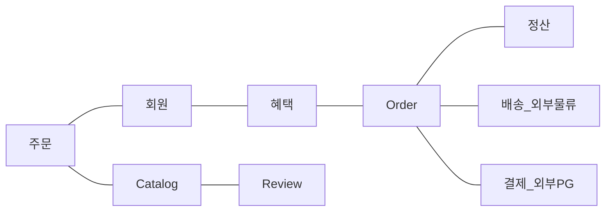

SW로 해결하고자 하는 문제 영역(ex: 온라인 서점).

한 Domain은 다시 하위 Domain으로 나눌 수 있다.
- Catalog 하위 Domain은 고객에게 구매할 수 있는 상품 목록을 제공, 주문 하위 Domain은 고객의 Order을 처리.

하위 Domain을 어떻게 구성할지 여부는 상황에 따라 달라진다.

배송, 결제와 같이 소프트웨어가 모든 Domain의 기능을 제공하지는 않는다.